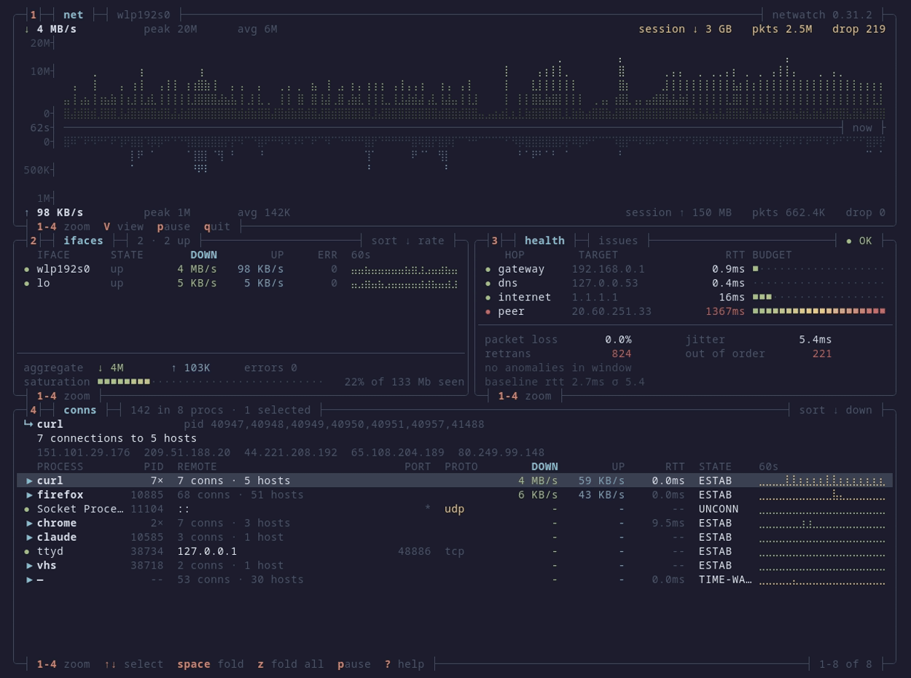

<p align="center">
  <h1 align="center">NetWatch</h1>
  <p align="center">
    <strong>Network diagnostics in your terminal.</strong>
  </p>
  <p align="center">
    <a href="https://crates.io/crates/netwatch-tui"></a>
    <a href="https://crates.io/crates/netwatch-tui"></a>
    <a href="https://github.com/matthart1983/netwatch/releases"></a>
    <a href="https://github.com/matthart1983/netwatch/releases"></a>
    
    
  </p>
  <p align="center">
    <a title="Tool of The Week on Terminal Trove" href="https://terminaltrove.com/netwatch/"></a>
  </p>
</p>

<p align="center">
  
</p>

<p align="center">
  <em><code>netwatch --view dense</code>. Four boxes, no chrome, every keybind on a border. Download grows up from the axis, upload grows down.</em>
</p>

One binary, no config. `sudo netwatch` and you have live capture with L7 decode, process attribution where available, and a diagnostic engine that opens an issue when a learned baseline breaks and closes it when the fix holds.

## Install

```bash
brew install netwatch                 # macOS / Linux
scoop install netwatch                # Windows (needs Npcap)
cargo binstall netwatch-tui           # prebuilt binary, anywhere with Rust
paru -S netwatch-tui                  # Arch (AUR)
nix-shell -p netwatch                 # NixOS / Nix
```

**Debian / Ubuntu** ([apt repository](https://matthart1983.github.io/netwatch/)):

```bash
curl -fsSL https://matthart1983.github.io/netwatch/apt/netwatch.gpg \
  | sudo tee /usr/share/keyrings/netwatch.gpg >/dev/null
echo "deb [signed-by=/usr/share/keyrings/netwatch.gpg] \
https://matthart1983.github.io/netwatch/apt stable main" \
  | sudo tee /etc/apt/sources.list.d/netwatch.list
sudo apt update && sudo apt install netwatch
```

**Fedora:** `sudo dnf copr enable matthart1983/netwatch && sudo dnf install netwatch`

**Container:** `docker run --rm -it --net=host --pid=host --cap-add=NET_RAW ghcr.io/matthart1983/netwatch`

**Binaries** for macOS, Linux (x86_64, aarch64, armv5te) and Windows are on the
[releases page](https://github.com/matthart1983/netwatch/releases/latest), with
`.deb`, `.rpm`, checksums and signed provenance. The Linux builds are static and
need nothing installed; Windows needs [Npcap](https://npcap.com/#download).
[Verifying a download](docs/REFERENCE.md#verifying-a-download) ·
[every channel](docs/PACKAGING.md).

## Run

```bash
netwatch              # interfaces, connections, config. No privileges.
sudo netwatch         # enables capture where elevated access is required
netwatch --lite       # one 80x24 screen
netwatch --view dense # four boxes, 130x44 or larger
```

`1` to `9` and `0` switch tabs, `V` cycles the three views, `?` shows every key. To run without sudo on Linux, grant the capabilities once: `sudo setcap 'cap_net_raw,cap_bpf,cap_perfmon+eip' "$(which netwatch)"` ([why and when to repeat it](docs/REFERENCE.md#running-without-sudo-linux)).

## The tabs

| # | Tab | Shows |
|---|-----|-------|
| 1 | Dashboard | Latency tiles, mirrored throughput, the link carrying it, connections rolled up per process |
| 2 | Connections | Every socket with process, PID, state, GeoIP, RTT, retransmits |
| 3 | Interfaces | Addresses, MTU, rates, errors, drops |
| 4 | Packets | Live decode, TLS 1.3 decryption, JA4, stream tracking, display filters, PCAP export |
| 5 | Stats | Protocol breakdown and handshake-timing histogram |
| 6 | Topology | Machine, gateway, DNS, top hosts, traceroute |
| 7 | Timeline | Connections by TCP state, with alerts |
| 8 | Processes | Bandwidth per process |
| 9 | Diagnose | Issue, cause, fix, verified close. `report.md` from the same objects |
| 0 | Egress | Learned destinations, promoted policy, drift |

[Every keybinding](docs/REFERENCE.md#keyboard-controls), [display filters](docs/REFERENCE.md#display-filters), [decoders](docs/REFERENCE.md#deep-packet-inspection), [themes](docs/REFERENCE.md#themes), [configuration](docs/REFERENCE.md#configuration).

## Views

`V` cycles all three without a restart; the collectors keep running.

| View | Size | For |
|---|---|---|
| Full | any | The ten tabs above |
| Lite (`--lite`) | 80x24 | An SSH session to a Pi, or a tmux split |
| Dense (`--view dense`) | 130x44+ | The hero image: four boxes, braille throughput, kernel TCP detail |

[Why they look like this](docs/DESIGN-0.30.md#8-dense-and-lite).

## Docs

| | |
|---|---|
| [Reference](docs/REFERENCE.md) | Keys, filters, decoders, configuration, permissions |
| [Diagnose](docs/REFERENCE.md#how-it-works) | Baselines, the 30 rules, ranked causes, verified closes |
| [TLS decryption](docs/REFERENCE.md#tls-13--12-decryption) | Point `SSLKEYLOGFILE` at netwatch and read your own traffic |
| [Egress linting](docs/egress-linter-plan.md) | Observe destinations, promote a policy, alert on what you block |
| [Security and forensics](docs/REFERENCE.md#security--forensics) | Beaconing, scans, DNS tunnelling, JA4, the flight recorder |
| [Capability matrix](docs/CAPABILITIES.md) | Platform differences, diagnostic limits and verification scope |
| [Attribution evidence](docs/attribution.md) | Identity, freshness, coverage denominators and controlled results |
| [Doctor command](docs/doctor.md) | Read-only setup report, JSON capabilities and optional capture check |
| [Design 0.30](docs/DESIGN-0.30.md) | Why the screens look the way they do |
| [Architecture](docs/WIKI.md) | Runtime, source map, permissions model, how to build and verify |
| [AI Insights](docs/INSIGHTS.md) | Optional LLM commentary inside Diagnose, off by default |
| [Prometheus export](docs/observability-export.md) | Exposed metrics and scrape config |
| [Packaging](docs/PACKAGING.md) | Every channel, and what updates it |
| [Changelog](CHANGELOG.md) | Every release |

## Related

[SysWatch](https://github.com/matthart1983/syswatch) and [DiskWatch](https://github.com/matthart1983/diskwatch) share the chrome. [ESSH](https://github.com/matthart1983/essh) is a Rust SSH client with the same look. [NetWatch Cloud](https://www.netwatchlabs.com) is hosted fleet monitoring built on the MIT [agent](https://github.com/matthart1983/netwatch-agent), [SDK](https://github.com/matthart1983/netwatch-sdk) and [dashboard](https://github.com/matthart1983/netwatch-dashboard).

## Thanks

Much of the packaging is other people's work. Dominiquini and kemelzaidan maintain [`netwatch-tui`](https://aur.archlinux.org/packages/netwatch-tui) and [`netwatch-tui-bin`](https://aur.archlinux.org/packages/netwatch-tui-bin) on the AUR, tomasrivera the [nixpkgs package](https://github.com/NixOS/nixpkgs/blob/nixos-unstable/pkgs/by-name/ne/netwatch/package.nix), [scillidan](https://github.com/scillidan) the [Scoop entry](https://github.com/ScoopInstaller/Main/blob/master/bucket/netwatch.json), and the Homebrew maintainers took the formula into core. File packaging problems with them and netwatch bugs here.

[@lamchau](https://github.com/lamchau), [@fdncred](https://github.com/fdncred) and [@PeteE](https://github.com/PeteE) sent patches. Everyone who opened an issue with a repro or argued with a design decision is the reason the output is right on more terminals than mine.

## Contributing

[Discussions](https://github.com/matthart1983/netwatch/discussions), [issues](https://github.com/matthart1983/netwatch/issues), [CONTRIBUTING.md](CONTRIBUTING.md).

## License

MIT
