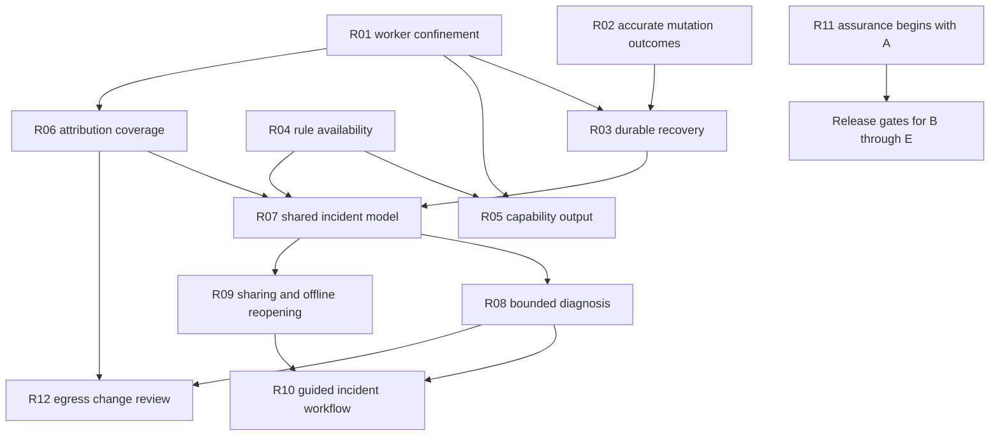

# Netwatch remediation implementation plan

Implement the trust fixes first: confine the actual workers, report host changes accurately, recover interrupted remediations, and distinguish missing diagnostic evidence from healthy measurements. Then complete the diagnostic session and incident handoff workflow. Egress change review follows those foundations.

This plan expands items **NW-R01–NW-R12** in the [gap assessment and roadmap](netwatch-roadmap.md). It is based on Netwatch **0.30.4**, commit `9b4597e`, rechecked on 10 September 2026. Proposed types, modules, commands, and release groupings below are implementation decisions to build, not existing functionality. No application changes are made by this document.

## 1. Delivery strategy

Deliver small changes with visible acceptance evidence. Preserve the existing deterministic engine, collectors, views, and export capabilities. Extract lifecycle and report assembly where necessary; avoid a broad rewrite of `App` or packet decoding.

The owner column identifies an accountable role, not additional staffing. One maintainer can fill several roles. Platform and security review require access to suitable reviewers or test machines before making the corresponding release claims.

| Release group | Scope | Accountable role | Completion condition |
|---|---|---|---|
| A — Immediate corrections | R02 initial outcomes, R04 availability, corrected documentation | Maintainer | No false “unchanged” or unqualified “healthy” result in the covered failure cases |
| B — Runtime and recovery | R01 confinement, R03 journal/recovery, R05 capability output | Runtime maintainer; security reviewer | Actual worker confinement and interrupted-operation recovery verified |
| C — Complete diagnosis | R06 attribution, R07 evidence model, R08 bounded sessions, initial R11 assurance | Runtime/diagnostics maintainer | Real collectors feed reproducible, finite diagnostic sessions |
| D — Incident handoff | R09 sharing/reopening, R10 guided workflow and timeline | Diagnostics/UI maintainer | A second engineer can reopen and understand evidence offline |
| E — Egress pilot | R12 workload identity and policy diffs | Maintainer; pilot users | Useful, explainable diffs in five real projects |

Release groups are acceptance milestones, not assigned version numbers. A correction may ship while larger work remains incomplete, provided its release notes accurately describe the remaining limitations. Do not delay truthful documentation until the underlying architecture is finished.

### Dependency order



R02 and R04 can be prepared independently. R01 and R03 share startup and privilege boundaries and require one agreed design before either changes the common startup path. R11 grows with the implementation; it is not a final testing phase.

## 2. Common contracts

### Lifecycle

Separate configuration and resource preparation from starting workers. The target lifecycle is:

`parse command → resolve explicit capabilities → recover eligible prior operations → prepare resources → enforce worker policies → receive readiness → collect → snapshot/export → stop and join → final recovery/state flush`

“Recover eligible prior operations” applies to live TUI, daemon, and live diagnostic sessions. Help, version, static doctor, and offline incident viewing must never change host configuration. Recovery inspection and recovery mutation are separate operations. Insufficient privileges produce a durable recovery-required status; they do not silently discard an operation.

### Measurement provenance

Introduce a small shared representation before broad report work:

```rust
// Proposed model; exact generics may change during implementation.
struct Sample<T> {
    value: Option<T>,
    source: CollectorId,
    sequence: u64,
    observed_at: Timestamp,
    age_ms: u64,
    status: MeasurementStatus,
}

enum MeasurementStatus {
    Available,
    NotCollected,
    PermissionDenied,
    Unsupported,
    Failed,
    Stale,
}
```

Preserve reasons as stable codes plus explanatory text. A value may remain available for historical display after it becomes stale, but must not qualify as a fresh verification sample. Scope measurements to interface/network/process identity where applicable. Use monotonic elapsed time for durations and UTC timestamps for interchange.

A failed probe is an observed result when the probe actually ran. A collector that failed to start is missing evidence. These cases must remain distinct throughout the engine, UI, and JSON.

### Stable boundaries

Keep incident schema version, rule-set version, application version, remediation journal version, and existing remote-envelope version separate. An incident schema change must not silently alter remote ingest or egress policy semantics. Add compatibility readers before switching writers, and preserve old evidence during migration.

## 3. NW-R01 — Confine actual workers and narrow filesystem access

**Priority:** P0. **Owner:** runtime maintainer with security review. **Entry points:** [main.rs](../../src/main.rs), [app.rs](../../src/app.rs), [sandbox](../../src/sandbox/mod.rs), [Linux backend](../../src/sandbox/linux.rs), [paths](../../src/sandbox/paths.rs), [packet capture](../../src/collectors/packets/mod.rs), [eBPF tracker](../../src/ebpf/conn_tracker.rs), and [TLS keylog support](../../src/dpi/tls_decrypt.rs).

The current application constructs and starts workers before applying Landlock. The `#[tokio::main]` runtime also exists before the function body executes. Remote publishing and logging have their own startup paths. Restricting the application thread alone is insufficient. The current allow-list additionally grants recursive access to the working directory; launching from a home directory can therefore include sensitive descendants.

### Implementation

1. Inventory every owned and dependency-owned worker: capture/decoder, TLS keylog, eBPF SDK source and drain, PKTAP, connection polling, health probes, GeoIP/WHOIS, insights, remote sender, metrics listener, logging, terminal events, and Tokio workers. Record creator, privileges, opened handles, input trust, filesystem needs, restart path, and shutdown owner. Commit this as `docs/runtime-lifecycle.md`.
2. Split construction from start. Proposed `RuntimeBuilder::prepare()` returns resources and a plan; constructors must not secretly begin capture or outbound requests. Audit dependency constructors such as `EventSource::new()` separately. If they spawn internally, require an SDK lifecycle hook or contain the dependency behind a process boundary; do not assume the drain thread represents the whole source.
3. Add worker readiness messages containing component ID, resource readiness, and actual confinement result. A worker may prepare handles, but must not consume untrusted input until its policy is enforced. Start the UI's “capture active” state only after readiness. Include bounded startup waits, cancellation, joins, and cleanup on partial failure.
4. Apply restrictions in the worker before processing, or create it from an already-restricted parent that has the needed resource handles. Introduce a synchronous bootstrap before constructing async runtime workers where required. Do not rely on newer kernel thread synchronisation as the sole mechanism for all supported systems.
5. Preserve restart behaviour through the same prepare/enforce/ready path. Best-effort mode may retain explicitly documented capture authority; strict mode must report when reopening cannot be supported after dropping it. A failed restart must never trigger an automatic unsandboxed retry.
6. Replace whole-CWD and whole-`/tmp` defaults with dedicated Netwatch output/state/scratch directories where feasible. Create required directories with deliberate ownership and permissions before restriction. Grant individual GeoIP files and narrowly scoped keylog access; account for rotation without silently granting a home-directory tree. Refuse overly broad export roots in strict mode and explain the narrower alternative.
7. Extend `sandbox::Report` with component-level requested/effective protections, retained capabilities, and failure reasons. Verify capability-drop results instead of recording a successful drop based only on prior presence. The aggregate report must not imply protection of an unverified component.
8. Define strict enforcement as an explicit set of required protections for enabled components. Unsupported required protections prevent startup. Best-effort remains usable with a visible limitation. Keep network restriction claims separate from filesystem restrictions; current outbound features need a reviewed networking policy.

### Architecture decision

The first milestone uses explicit worker lifecycle and confinement, with temporary instruction-only host remediation. A privileged helper is a separate design decision before restoring broad automatic resolver management. If dependency-owned threads cannot be covered, or safe capture restart requires excessive parser authority, use a helper that opens approved capture resources and emits bounded messages to an unprivileged parser. Specify helper authentication, inherited-handle/IPC lifecycle, maximum message lengths, and teardown before implementing it. Keep arbitrary commands and paths out of that protocol.

### Tests and acceptance

Run confinement tests in disposable child processes because restrictions cannot be undone in the test runner. Use a temporary fake home with a sentinel secret file. Launch from that home, from a normal project directory, and from a dedicated export directory. Have the actual capture/keylog worker attempt denied access before and after capture restart; check permitted exports and keylog reads still work. Test unavailable Landlock, missing capabilities, strict failure, failed worker startup, fresh state directories, and graceful shutdown.

**Done when:** every enabled input-processing worker has a verified protection result; denied-access tests pass at the actual worker boundary; strict startup cannot succeed with an uncovered required worker; best-effort limitations are visible; no broad “cannot read your SSH keys” claim exceeds the configured allow-list. Correct the stale module-level network/capability documentation at the same time.

## 4. NW-R02 — Report mutation outcomes truthfully

**Priority:** P0, first correction. **Owner:** diagnostics maintainer. **Files:** [remediation.rs](../../src/diagnose/remediation.rs), [issue.rs](../../src/diagnose/issue.rs), `app.rs::apply_pending_remediation`, Diagnose rendering, and report rendering.

The current final journal flush can fail after the target was edited, while the caller prints “host unchanged.” Read errors also become empty contents in several paths. Fix this before changing the persistence format.

### Implementation

1. Introduce an internal `MutationOutcome`: `NotChanged`, `Applied`, `Reverted`, or `RecoveryRequired`. Include operation ID, last completed stage, verified current-state summary, and recovery location. Carry failures with this outcome rather than using an undifferentiated I/O error.
2. Reserve `NotChanged` for failures before target mutation or a verified unchanged target. A failed write can be partial; a failed post-write journal update must be `RecoveryRequired` unless rollback has been completed and verified.
3. Replace `read(...).unwrap_or_default()` in mutation/recovery paths with explicit missing/unreadable outcomes. Do not turn an unreadable resolver into a new empty file. Preserve the distinction between target absence and empty contents.
4. Make UI, status, timeline, and report consume the same outcome. Example: “Resolver changed; recording completion failed. Recovery required; backup: …”. Do not close an issue solely because an apply call returned success.
5. Parse journal load into `Missing`, `Loaded`, `UnsupportedVersion`, `Corrupt`, or `Unreadable`. Preserve invalid bytes and block further mutations until recovery is resolved; allow read-only monitoring with the limitation shown.
6. Temporarily make automatic resolver editing unavailable unless a reviewed adapter and recovery store can guarantee the required stages. Show manual instructions and the reason. Merely running as root does not establish filesystem permission under Landlock or resolver-manager ownership.

### Tests and acceptance

Use the existing fake `Host` as a starting point. Add an operation-index fault injector for read, backup write, target write, and journal flush, including a target write that writes a prefix then fails. Assert target bytes, preserved backup, journal state, and the outcome exposed to every surface. Add a regression for final-flush failure after successful target write and for unreadable original content.

**Done when:** every mutation failure reports a truthful state; unknown or partial state never becomes “unchanged”; corrupt recovery data never silently becomes an empty history; unsupported actions remain instructions.

## 5. NW-R03 — Durable recovery and supported resolver adapters

**Priority:** P0. **Owner:** runtime/diagnostics maintainer. **Depends on:** R02 and the R01 privilege design. **Files:** current remediation module and startup/shutdown call sites. Proposed new modules: `src/diagnose/remediation/{store,transaction,resolver}.rs` and `src/runtime/bootstrap.rs` as the module grows.

### Recovery store and ownership

Use a versioned journal with unique operation IDs and a unique immutable backup per operation. Persist original and installed digests, target identity, adapter kind, timestamps, and owner identity. Owner identity should include a session UUID and a platform-verifiable process-start token; Linux can additionally use boot identity. PID alone cannot establish ownership. If ownership cannot be verified, retain recovery-required status and avoid speculative rollback.

Use OS-backed locking covering the load/validate/update transaction. Locks must have the same scope as the resource: two users editing a host-wide resolver need host-wide serialisation through the authorised adapter/helper, not independent per-user cache locks. Keep a resource lease while a temporary change is active. Liveness checks supplement the lease; a lock-file's existence alone is not a live owner.

Keep authoritative recovery data in durable application state rather than disposable cache. A privileged component must not trust user-editable journal paths or follow attacker-controlled symlinks. Validate ownership and target identity. Define the treatment of old cache journals before moving anything: read and preserve legacy entries, classify unverifiable state, and migrate only what can be validated. No silent overwrite or automatic execution of a legacy path.

### Transaction protocol

| Stage | Required durable evidence | Failure behaviour |
|---|---|---|
| Validate | Supported adapter, authority, target identity and readable original | NotChanged; explain unsupported/permission state |
| Prepare | Exclusive lease; immutable original backup synced; Prepared record persisted | No target mutation; preserve any evidence created |
| Apply | Adapter executes bounded change and reads back effective state | Record possible partial state; attempt only an adapter-supported safe rollback |
| Verify recording | Applied record persisted with installed identity/digest | On failure, report RecoveryRequired even if the new resolver works |
| Commit permanence | Explicit keep action durably recorded | Until durable success, change remains temporary; explain ambiguous failure |
| Revert | Restore only when current state still matches this operation's installed state | External changes or unreadable state stop automatic rollback |
| Complete | Reverted/committed terminal record durably stored | Preserve evidence until the completion state is durable |

Implement durable journal replacement using same-directory temporary files, complete writes, file synchronisation, atomic replacement where supported, and parent-directory synchronisation where required. Preserve ownership and intended permissions. Encapsulate platform differences in the store; do not assume a single Unix rename sequence is portable to Windows. A successful simulated write-order test alone does not prove power-loss durability.

### Resolver boundary

Recognise unmanaged regular files, systemd-resolved, NetworkManager, and unsupported/unknown ownership. Initially enable automatic edits only for the adapter whose behaviour and authority have been verified; instructions are the fallback. Managed resolvers require a manager-specific adapter that snapshots and restores the relevant per-link settings. Do not replace `/etc/resolv.conf` symlinks or assume editing the file changes effective resolution.

A host-changing adapter runs through explicit, authorised authority. Do not expand the packet parser's filesystem permissions to enable remediation. If a helper is required, it accepts typed resolver operations and validated addresses, never arbitrary shell commands. Keep macOS and Windows apply actions unavailable until their adapters and recovery semantics are implemented and tested.

Move recovery inspection and eligible rollback into shared live bootstrap. A daemon following a crashed TUI must discover the same operations. Read-only command paths must not execute recovery. Shutdown cancels new actions, reverts temporary changes where safe, persists unresolved outcomes, and joins workers with bounded waits.

### Tests and acceptance

Exercise every transaction boundary with deterministic faults; process-kill tests between stages; truncated/version-unknown journals; disk-full/permission failures; two competing instances; external edits; changed symlinks; PID reuse; absent backup; and restarts through TUI, daemon, and finite diagnosis. Use fake resolver files or disposable VMs/namespaces, never the developer machine's actual resolver. Test durable storage behaviour on supported filesystems and bound power-loss claims to the tested contract.

**Done when:** interrupted operations remain discoverable; supported automatic recovery restores only Netwatch-owned changes; original backups cannot be overwritten by another operation; no read-only command mutates the host; privilege and corruption failures preserve an actionable recovery record.

## 6. NW-R04 — Evidence-aware diagnostic availability

**Priority:** P0. **Owner:** diagnostics maintainer. **Files:** [rules.rs](../../src/diagnose/rules.rs), [live.rs](../../src/diagnose/live.rs), [detectors.rs](../../src/diagnose/detectors.rs), [engine.rs](../../src/diagnose/engine.rs), [baseline.rs](../../src/diagnose/baseline.rs), [report.rs](../../src/diagnose/report.rs), Diagnose/Dense/Lite views.

### Implementation

1. Separate catalogue implementation status from per-subject runtime evaluation. Add `RuleRequirements` with necessary/alternative measurements, maximum age, baseline requirements, supported scope, and optional active tests. A rule with a valid absolute-threshold alternative must not be disabled merely because its baseline is learning.
2. Add `RuleAvailability`: available, learning, unsupported, missing permission, not measured, stale, or collector failed. Return reason codes and next checks. Compute it from actual observations, never just a feature flag or catalogue count.
3. Immediately mark local bufferbloat as not measured when loaded/idle RTT is absent. Generate the UI count and README capability table from the same catalogue. Audit every one of the 25 entries; commit a matrix linking each to its live input and trigger/recovery fixture.
4. Gate issue opening and recovery on fresh required evidence. Existing open issues whose inputs disappear become unverified/stale; they must not close because the detector returned no result. Distinguish a resolved finding from a monitoring gap.
5. Replace `Report::summary_line()`'s empty-list implication of health with a shared verdict object. Suggested text: “No findings in 8 evaluated checks; 5 unavailable, 2 learning.” A genuinely scoped healthy result must name that scope and adequate evidence. Reports must also distinguish “no issues currently open” from “no issues occurred during the window”; resolved incidents still belong in the report.
6. Audit sampling cadence: collector sequence IDs prevent repeated presentation of a cached sample from satisfying consecutive-sample tests or baseline learning. Learning requires enough distinct observations and actual elapsed coverage. Use a clock abstraction to verify independence from UI refresh rate, suspend/resume, and network changes. Treat this as a validation task until a specific defect is reproduced.
7. Keep cause support explainable: list contributing and missing checks. Do not label a weighted fraction as a calibrated probability. Existing values require an explicit presentation change, not a silent scoring change.

### Tests and acceptance

Cover all catalogue entries, missing prerequisites, alternative checks, stale samples, no-data startup, network switching, repeated sequence IDs, closed issues in a report window, collector failure during recovery, and true fault recovery. Run representative scenarios through the actual observation adapter as well as detector fixtures.

**Done when:** every advertised rule has a traced live path or an explicit limitation; missing data cannot produce false health or false recovery; TUI, preview, Markdown, and JSON agree on scope and coverage.

## 7. NW-R05 — Capability output, platform matrix, and onboarding

**Priority:** P1, with documentation corrections in A. **Owner:** runtime/UI maintainer. **Depends on:** R01/R04. **Files:** `main.rs`, `config.rs`, sandbox reports, attribution status, `ui/settings.rs`, `ui/help.rs`, README, REFERENCE, INSIGHTS. Proposed `src/runtime/capabilities.rs` and `src/cli.rs`.

Create a serialisable `CapabilitySnapshot` describing interface selection, Npcap/libpcap availability, capture readiness, attribution backend and fallback, probe support, TCP metrics, sandbox components, enabled external services, and available remediation adapters. Preserve known limitations per platform rather than filling absent fields with zero.

Add proposed commands `netwatch doctor` and `netwatch doctor --json`. Static doctor inspects configuration and dependencies without capture, remote publishing, active probes, or host recovery. A separate `--check-capture` performs a bounded open/close using the real startup path and reports its effective protection. Diagnostic checks should not implicitly enable configured cloud streaming. Route static/offline commands before Windows Npcap initialisation.

Replace ad-hoc argument searching with one command model as subcommands are introduced. Preserve existing invocation and aliases; reject missing values and conflicting options. Generate help from that model. Show a short first-run capability summary with a way to inspect details, rather than a new mandatory setup wizard.

Correct stale Insights tab instructions, optional AI data-flow description, sandbox/network comments, and “all rules active” wording. Explain where reports are written and why protection or attribution is reduced. Make help and version work without drivers or writable state directories.

**Tests:** CLI compatibility, missing Npcap, no capture authority, no interface, Linux without eBPF, unsupported sandbox, malformed options, no external I/O from static doctor, and accessible output at 80×24. **Done when:** a user can distinguish no traffic from no observation capability without reading source code.

## 8. NW-R06 — Attribution identity, freshness, and coverage

**Priority:** P1. **Owner:** collector maintainer. **Depends on:** R01. **Files:** [connections](../../src/collectors/connections.rs), [eBPF](../../src/ebpf/conn_tracker.rs), [PKTAP](../../src/platform/pktap.rs), process bandwidth, packet stream keys, Connections/Processes/Egress UI.

Extend the existing attribution source rather than inventing a second independent attribution pipeline. Separate backend readiness from the provenance of an individual match. Add match observation time, process-start identity where available, and a stable unknown reason. Avoid silently reassigning a reused PID or reused five-tuple to an old executable.

Define a session flow key using protocol, endpoints, observation generation/start, and network namespace where available. Add process identity as host/session, PID, process-start token, and executable identity. Executable hashing is optional and cached per file identity; do not hash every binary every tick. A hash alone does not identify scripts sharing an interpreter, so reserve workload/session metadata for R12.

Display flow coverage and byte coverage separately. Denominators must explicitly identify eligible observed flows; zero observed flows is “not measured,” not 100%. A working eBPF backend does not prove complete capture or attribution. Report captures lost, event-source limitations, stale process snapshots, and fallback operation without merging these into a misleading single percentage.

Build controlled workload generators that independently log their PID, process start, protocol, endpoints, and timing. Test pre-existing/short-lived/long-lived TCP and UDP, IPv4/IPv6, close/reopen, PID churn, sandbox restart, and missing BPF authority. Include macOS PKTAP and Windows polling scenarios with their own expected limits. Linux namespace/cgroup identity is a bounded addition; Kubernetes API integration is deferred.

**Acceptance:** at least 95% correct attribution of eligible observed flows in the agreed supported controlled scenarios, with wrong attribution counted separately from unknown. No stale identity misattribution in deterministic reuse cases. Publish results by platform, backend, lifetime, and protocol; the aggregate must not conceal a failing subgroup.

## 9. NW-R07 — One incident and evidence model

**Priority:** P1. **Owner:** diagnostics maintainer. **Depends on:** R02/R04; final capabilities/identity integrate from R03/R06. **Files:** [incident recorder](../../src/collectors/incident.rs), diagnostic reports and issue model, `app.rs::build_diagnose_report`. Proposed `src/incident/{mod,schema,assemble,store}.rs`.

### Package contract

```text
incident-<uuid>/
  manifest.json        schema/application/ruleset versions and completeness
  report.json          canonical saved findings and evidence references
  report.md            human-readable rendering of the saved report
  events.jsonl         bounded, timestamped incident events
  observations.jsonl   optional measurements required for reassessment
  packets.pcap         optional explicitly selected raw evidence
```

The manifest records incident/session IDs, UTC window, monotonic ordering origin, capture interfaces and epochs, collector capabilities, available measurements, packet/event truncation, sharing profile, and artifact names/sizes/digests. Digests detect corruption; they are not proof of authenticity. Record enough baseline context to interpret evidence without copying unrelated historical networks.

Assign IDs at event creation, not render time. Link issue evidence to observations and packet/flow references where retained. A packet missing due to retention produces an unavailable reference with a reason. Store original findings separately from future recomputation.

Create one immutable incident snapshot for both report formats and recorder export. Freeze/snapshot must be internally consistent while collectors continue; avoid holding the capture lock for disk I/O. Retain bounded-memory behaviour and record evictions. Export to a unique temporary directory and publish the completed manifest/package only after required writes succeed. Preserve useful partial output with an explicit incomplete marker on failure; timestamps alone must not cause directory collisions.

Define a compatibility reader for current v1 recorder bundles and standalone reports. Missing provenance in old files stays unknown. Keep current export controls and filenames where practical through compatibility adapters; do not change the remote publisher envelope.

**Tests:** concurrent snapshot consistency, burst capture, truncation, two exports in the same second, disk-full failure, missing optional artifacts, clock changes, deterministic semantic report rendering, and legacy package reading. **Done when:** both reports represent the same frozen evidence and every omission is visible.

## 10. NW-R08 — Bounded headless diagnosis

**Priority:** P1. **Owner:** runtime/diagnostics maintainer. **Depends on:** R04/R05/R07 and common recovery lifecycle. **Files:** `main.rs`, `app.rs::run_headless`, collectors, diagnostic engine. Proposed `src/runtime/{mod,session}.rs`.

Extract `RuntimeSession` as owner of collectors, cancellation, snapshots, and diagnosis. `App` becomes a consumer for the affected paths. Existing `netwatch daemon` remains continuous; add a separate finite command:

```text
netwatch diagnose --duration 60s --json
netwatch diagnose --duration 60s --output <directory>
```

These are proposed interfaces. Bound individual probe timeouts, worker startup, and shutdown separately from the observation duration. Avoid blocking the Tokio selector with synchronous collector or export work. Install signal handling early; cancellation must prevent new active work and preserve available evidence. JSON stdout contains one documented result envelope; progress goes to stderr. Disable configured AI/cloud publication for this command unless explicitly selected for that invocation.

Define exit statuses before implementation: `0` completed with no qualifying finding and adequate requested coverage; `1` qualifying finding; `2` incomplete coverage or operational failure without a qualifying finding; `64` invalid invocation; `130` interruption. When findings and incomplete coverage coexist, return `1` and retain incompleteness in JSON. Schema fields are authoritative for callers needing finer distinctions. Define qualifying severity with an explicit threshold option. A short session on a new network can legitimately return incomplete while baselines learn.

Active loaded-latency testing is a separate opt-in extension. Require an explicit controlled endpoint, duration, traffic/byte budget, cancellation, and clear disclosure of generated load. Collect idle/load/recovery windows through the same clock/provenance system. Do not silently saturate a production uplink, and do not enable the bufferbloat rule just because a flag was supplied. Unsupported endpoints or insufficient load leave the measurement inconclusive.

**Tests:** finite completion with dead targets; SIGINT during startup/probe/export; missing privileges; no-data and learning sessions; successful detection/recovery; JSON validity; stdout purity; and cleanup of workers/resources. **Done when:** an automated caller can tell finding, incomplete observation, and execution failure apart reliably.

## 11. NW-R09 — Sharing profiles and offline reopening

**Priority:** P1. **Owner:** incident maintainer. **Depends on:** R07 and CLI routing from R05. Proposed `src/incident/{privacy,reader}.rs` plus report/export UI.

Introduce three explicit profiles:

| Profile | Content | Default behaviour |
|---|---|---|
| Share | Structured summary, pseudonymised identities, coverage, timings | Default for new sharing flow; omit raw packets, secrets, and arbitrary captured text |
| Diagnostic | Selected detailed observations and identifiers | Preview the information categories included |
| Raw | Original packet evidence plus selected details | Explicit opt-in; clearly identify sensitive raw data |

Use an allow-list of serialised fields for Share. Transform structured identifiers before generating text; do not run regexes over rendered Markdown and call it redacted. Stable pseudonyms are package-local and the reversal map is excluded. Strip credentials, URL query values, executable paths, DNS names, hostname/IP identity, and uncontrolled free text unless the profile explicitly includes them. Keylog secrets are never included automatically in any profile. Pseudonymisation does not guarantee anonymity; avoid that claim.

Add proposed `netwatch incident open <directory>` with an offline viewer using saved findings. Its execution path must not construct live collectors, read current network state, initialise Npcap, run recovery, resolve hostnames, or start remote/AI clients. Display collection time and versions prominently. Escape terminal control sequences and HTML in imported text.

Treat imported bundles as untrusted: enforce maximum sizes/counts/depth, reject path traversal and symlink escapes, validate required digests, handle unknown schema versions explicitly, and keep parsing failures out of the render loop. Begin with directory packages; archive extraction is separate scope. A future `reassess` command writes a derived report with a new engine version and never overwrites saved findings.

Migrate current export UX deliberately: preserve explicit raw PCAP export, explain the new default share profile, and make the output path visible. Do not silently remove evidence from an operation named “raw capture export.”

**Tests:** seeded secrets in structured fields/free text/URLs, stable pseudonyms, absent reversal map, file permissions, malicious paths and control sequences, corrupted artifacts, unsupported versions, no-network execution on a machine without capture drivers, and old bundle compatibility. **Done when:** a second machine can inspect saved evidence safely and understand what was omitted.

## 12. NW-R10 — Guided diagnosis and a correlated timeline

**Priority:** P1. **Owner:** diagnostics/UI maintainer. **Depends on:** R07/R08/R09. **Files:** Diagnose, Dashboard, Connections, Packets, Timeline and Topology views; event and issue models.

Add three task entry points: application slowness, network reachability, and changed destinations. Each selects a scope and a diagnostic plan using the existing engine. Show measured stages, unavailable stages, strongest supported explanation, next useful check, and evidence/export action. Preserve expert tabs and Dense/Lite views.

Introduce a shared navigation context with incident, subject, selected time window, and optional flow ID. Drill-through from an issue to Connections and Packets retains that context; Escape returns to the originating selection. If evidence has expired, say so instead of showing unrelated current traffic.

Extend the existing timeline with structured issue-open/update/close, collector-loss/recovery, interface/route/resolver change, egress drift, and remediation outcome events. Sort by recorded timestamps with sequence tie-breakers. Use one time cursor across relevant panels; historical inspection must not silently substitute live values. Bound event retention and mark gaps. Keep correlation labelled as evidence, not proof of causation.

Audit suppression scoping as part of multi-interface support: a fault on one interface must not suppress an unrelated healthy interface's finding. Test VPN, multiple routes, and resolver changes. Keep status colours consistent and annotate stale data; do not require colour or a particular glyph to understand the result.

**Tests:** scripted fault/recovery sessions and UI interactions at 80×24, normal full size, and Dense size; keyboard-only drill-through; lost evidence; simultaneous interface incidents; closed findings retained historically. **Usability gate:** four of five pilot engineers can identify the supported explanation and export/open the relevant incident within five minutes without coaching. Record confusion and revise the workflow before adding more presentation features.

## 13. NW-R11 — Release assurance, fuzzing, and performance

**Priority:** P1 with P0 regression coverage delivered immediately. **Owner:** maintainer/release reviewer. **Files:** [.github/workflows/ci.yml](../../.github/workflows/ci.yml), [release workflow](../../.github/workflows/release.yml), `examples/`, proposed `tests/integration/`, `fuzz/`, and `benches/`.

Keep the existing formatting, Clippy, build, and three-OS test checks. Add no-default-features compilation/tests because fallback behaviour is part of the product. Separate tests requiring raw capture, BPF, or host privileges from ordinary PR tests. Run privileged suites only on isolated trusted runners/VMs, with no production credentials and no untrusted PR execution on a privileged host.

Start fuzz targets at wire input and imported evidence: packet dispatch, DNS/TLS/QUIC parsing, stream reassembly, compressed HTTP/3 content, display filters, and incident reader. Enforce allocation, decompression, recursion, stream-count, and time budgets. Keep crash reproducers in the regression corpus after minimisation. A successful fuzz duration is evidence of testing, not proof of parser safety.

Build performance profiles for idle monitoring, ordinary desktop traffic, many short connections, sustained capture, TLS keylog/decode, and armed recorder. Record commit, compiler, OS/kernel, CPU, traffic generator, packet sizes/rates, enabled features, and duration. Measure CPU, RSS, retained buffers, capture drops, attribution coverage, collection lag, event queue drops, and p95 input-to-render latency. Use the existing pcap statistics as the primary capture-loss source and label their limits.

Establish a baseline first. Investigate reproducible regressions above 10% on stable profiles; choose hard product budgets after measuring target hardware. Run a shorter repeatable PR smoke and scheduled longer soak. Avoid comparing noisy shared-runner timings as if they were controlled benchmarks.

Add dependency vulnerability/license review and release-artifact checks appropriate to the actual build. Produce an inventory/SBOM and provenance where the release system supports it; verify signatures/checksums and installation smoke paths. These improve distribution assurance and do not replace runtime tests.

**Done when:** critical fixes have scenario evidence, fuzz targets enforce resource bounds, fallback builds work, published performance numbers are reproducible, and release artifacts are exercised through supported installation paths. Record known failing or skipped platform cases in release notes.

## 14. NW-R12 — Egress change-review pilot

**Priority:** P2. **Owner:** maintainer with five pilot projects. **Depends on:** R06 identity, R08 finite sessions, and R07 versioned output. **Files:** [egress policy](../../src/collectors/egress/policy.rs), egress profiler, Processes/Egress UI, CLI/session model.

Begin with explicit before/after sessions over selected workloads. Prefer attaching to an identified process tree or cgroup over introducing arbitrary process execution in the first release. If a later command launches a workload, define lifecycle and environment handling separately.

Store reviewed baseline metadata: workload identity, observation window, coverage, destinations, evidence method, policy version, and selected approved scope. Do not automatically promote learned traffic into trusted policy. Surface added/removed destinations, new ports, broadened matching, undeclared processes, and identity uncertainty. A broad ASN match remains visibly broader than hostname identity; ECH/no-readable-name states remain explicit.

Preserve current policy matching semantics by versioning any new schema. Add exceptions with reason, owner label, expiry, and exact scope. Learning, reviewing, approving, and evaluating are separate steps. A dependency update is not malicious merely because it changes destinations.

Emit deterministic JSON suitable for CI. Define result classes for no observed drift, observed drift, and incomplete observation; incomplete sessions cannot pass as clean. Optional CI failure on drift is an observation verdict, not traffic blocking. Keep a reviewable TOML/JSON diff and make reports useful outside Netwatch.

**Tests:** shared process names, interpreter workloads, changed binary identity, expected CDN changes, port restrictions plus SNI/ASN/IP matching, expired exceptions, unknown attribution, encrypted names, short sessions, and policy round trips. **Pilot gate:** five projects complete real before/after reviews; record false alarms, review time, explainability, and return usage. Expand only if users can identify actionable changes consistently.

## 15. Pull-request sequence

Each PR should explain the triggering condition, resulting behaviour, relevant tests, and remaining limitations. Split migrations into reader support before writer changes. The sequence below is concrete enough to become issues; it does not require a single long-lived branch.

| PR | Scope | Depends on | Review evidence |
|---|---|---|---|
| 01 | Accurate mutation outcomes and non-silent journal load errors | None | Final-flush/partial-write regression cases |
| 02 | Rule prerequisites and evidence-aware verdict/report summary | None | Missing-input, stale-recovery, closed-window cases |
| 03 | Correct capability, sandbox and Insights documentation | 01/02 where applicable | Checked against current UI/runtime |
| 04 | Worker inventory and resource/start split | None | Existing behaviour preserved; no hidden starts in refactored constructors |
| 05 | Worker enforcement/readiness and narrow path defaults | 04 | Actual-worker isolation plus restart/fresh-install tests |
| 06 | Common bootstrap and explicit recovery authority | 01/04/05 | TUI/daemon parity; offline/static commands remain read-only |
| 07 | Journal v2 reader, ownership/locking and durable store | 01/06 | Legacy migration, corruption, concurrency and fault injection |
| 08 | Supported resolver transaction adapter and rollback | 07; helper decision if needed | Disposable-host recovery evidence; truthful disabled states elsewhere |
| 09 | Capability snapshot, CLI model and doctor | 02/05 | Platform/argument and no-network doctor tests |
| 10 | Attribution identity/freshness and coverage | 05 | Independent traffic-generator comparisons |
| 11 | Shared incident schema, snapshot/export and legacy reader | 02/07/10 | Consistency, truncation and round trips |
| 12 | Finite diagnostic sessions | 06/09/11 | Deadlines, cancellation, stdout and exit status contracts |
| 13 | Sharing profiles and defensive offline reader | 09/11 | Seeded sensitive data, malformed package, offline tests |
| 14 | Guided diagnosis, linked navigation and shared timeline | 12/13 | Multi-interface scenarios and usability sessions |
| 15 | Optional loaded-latency measurement | 02/12 | Controlled endpoint, load budget, inconclusive outcomes |
| 16 | Workload session diff and reviewed exceptions | 10/12 | Policy/identity regressions and pilot review evidence |

Fuzzing, performance profiles, dependency checks, and release validation are incremental PRs alongside 05–16. They should not be bundled into an oversized final assurance PR.

## 16. Required scenario suite

| Scenario | Expected result | Primary release gate |
|---|---|---|
| Capture starts before UI and attempts disallowed read | Worker denied; no false aggregate protection | B |
| Launch in fake home / broad keylog parent | Sensitive descendants excluded or strict configuration rejected | B |
| Capture restart under strict/best-effort | Same declared protection; explicit failure if unsupported | B |
| Journal flush fails after resolver write | RecoveryRequired with preserved original | A/B |
| Resolver write partially succeeds | Never NotChanged without verified restoration | A/B |
| Corrupt/unknown-version legacy journal | Original preserved; mutation blocked; monitoring available | A/B |
| Two instances / reused PID / external resolver edit | No unsafe ownership claim or overwrite | B |
| Daemon starts after TUI crash | Eligible operation discovered through common recovery | B |
| No capture/probe permission | Coverage missing; no unqualified healthy verdict | A/C |
| Loaded-latency input absent | Bufferbloat unavailable, not healthy | A/C |
| Cached samples repeat across UI ticks | No invented learning or recovery progress | C |
| Genuine fault then fresh sustained recovery | One scoped issue opens and closes with evidence | C |
| An issue closes before export | Historical incident preserved; current state distinguished | C |
| Short-lived IPv4/IPv6 TCP/UDP flows | Backend-specific attribution accuracy and gaps measured | C |
| Two interfaces with unrelated faults | Suppression respects actual subject scope | D |
| Bundle export during capture / memory truncation | Coherent snapshot; completeness explicit | C/D |
| Secrets seeded in report fields and free text | Share profile excludes them | D |
| Malformed package / path escape / terminal controls | Safe rejection or escaped rendering | D |
| Open incident without network or Npcap | Saved findings render with no live initialisation | D |
| Bounded diagnosis with dead target / SIGINT | Deadline/cancellation contract and cleanup hold | C |
| Egress diff with missing attribution | Incomplete; never a clean CI verdict | E |

Fixture tests verify logic; live collector tests verify measurement plumbing; subprocess/VM tests verify privilege and recovery behaviour. Keep these evidence types separate in the release checklist.

## 17. Estimates, release decisions, and rollback

The earlier roadmap's four-week trust phase was directional. The detailed scope includes dependency-owned workers, broad path allowances, durable recovery, and resolver authority; treating all of that as a four-week commitment would be optimistic.

| Work group | Initial effort range |
|---|---|
| Immediate truthful outcomes, availability and documentation | 1–2 engineer-weeks |
| Worker lifecycle/confinement and common bootstrap | 3–5 engineer-weeks |
| Durable recovery and first supported resolver adapter | 3–5 engineer-weeks |
| Capabilities and attribution validation | 2–4 engineer-weeks |
| Incident model and bounded diagnosis | 3–5 engineer-weeks |
| Sharing, reopening and guided workflow | 4–6 engineer-weeks |
| Assurance work across these changes | 2–4 engineer-weeks |
| Optional loaded-latency test and egress pilot implementation | 3–5 engineer-weeks |

These are rough effort ranges, not calendar promises or statistically calibrated estimates. Approximately **18–31 engineer-weeks** covers the core through incident handoff and assurance; optional work adds **3–5**. A new privileged helper or SDK changes can increase this. Re-estimate after PR05 using actual startup and platform findings. Platform availability, review, and pilot recruitment add elapsed time.

A release candidate requires the applicable scenarios above, normal CI, targeted live platform checks, a migration/compatibility note, and documentation of unimplemented capabilities. Roll back UI additions or disable new active features if needed, but do not downgrade to a binary unable to read an active journal format. Preserve recovery compatibility across rollback releases. New rule thresholds should be versioned and tested against the incident corpus before becoming defaults.

Track completion by accepted behaviour and evidence, not merged lines or feature count. The first success is a trustworthy tool under missing permissions and failed writes. The next is a repeatable diagnosis that another engineer can inspect. Fleet expansion, enforcement, and broad new protocol work remain outside this implementation plan.

## 18. Plan verification and reference notes

The checkout remained at `9b4597e` during planning. The earlier **958 passing / 3 ignored** library result belongs to the preceding review; it was not rerun for this documentation-only change. The plan's proposed acceptance tests have not yet been implemented or passed.

The worker-order, mutation-write, missing-bufferbloat-input, and daemon-reconciliation observations were checked against the current source. Closer inspection additionally identified recursive working-directory permission, empty-report health wording, and pre-body async runtime creation as implementation considerations. Sampling-cadence correctness, platform-specific transaction durability, and dependency worker coverage remain tasks to establish through focused tests and dependency review.

Refer to the [research report](netwatch-roadmap.md) for the competitive rationale and external sources. The [Linux Landlock documentation](https://www.kernel.org/doc/html/latest/userspace-api/landlock.html) explains thread inheritance/synchronisation; [Wireshark's capture architecture](https://www.wireshark.org/docs/wsdg_html_chunked/ChWorksCapturePackets.html) provides a reference for separating privileged capture. Actual API choices must be checked against the pinned dependencies and supported operating systems when implementing each PR.
